# Overview of results so far

<link rel="stylesheet" href="style.css"></link>
## Basics and local stuff
built TF from source for 2x speed increase on local machine

## modifying `adaptive-style-transfer`
added functionality for reencoding with the following features:
* `--reencodes n` reencodes the data n times
* `--reencode_steps n` save every n-th step of the reencoding process
* `--embeddings` save the embeddings as numpy binary file for every n-th step specified in `--reencode_steps`
* `--log` log interesting variables for reencoding such as the norm of the feature vector as well as the distance between consecutive feature vectors and mainly log the feature vectors themselves for visualization in TensorBoard which allows for PCA and t-SNE

## results
After around 10 iterations the original image content is hardly recognisable anymore.
> TODO: Insert original image and after 10 iterations, van gogh and picasso

While the abstraction is more obvious for the first few iterations, the image seem to vary less for later iterations.

<table style="width:100%; table-layout:fixed">
 <tr>
  <td></td>
  <td><a href="images/van-gogh/image1_s=1.jpg"> 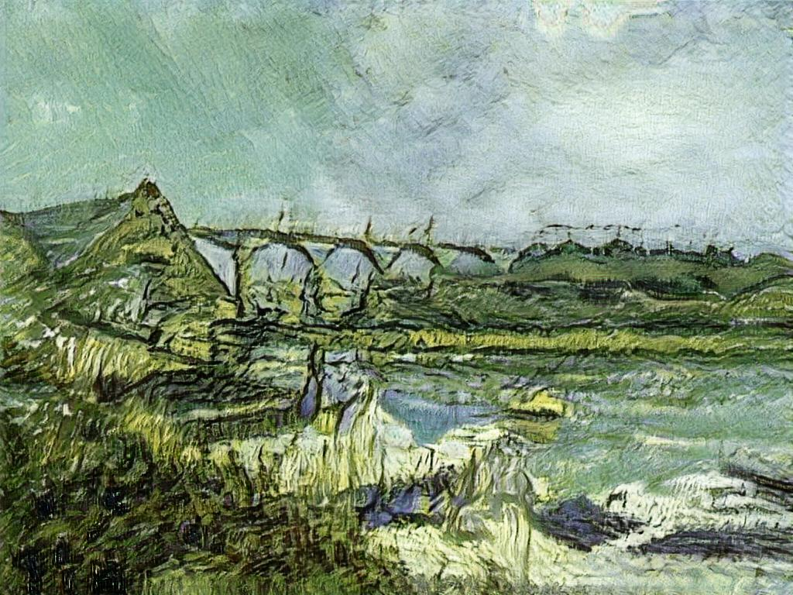</a></td>
  <td><a href="images/van-gogh/image1_s=5.jpg"> 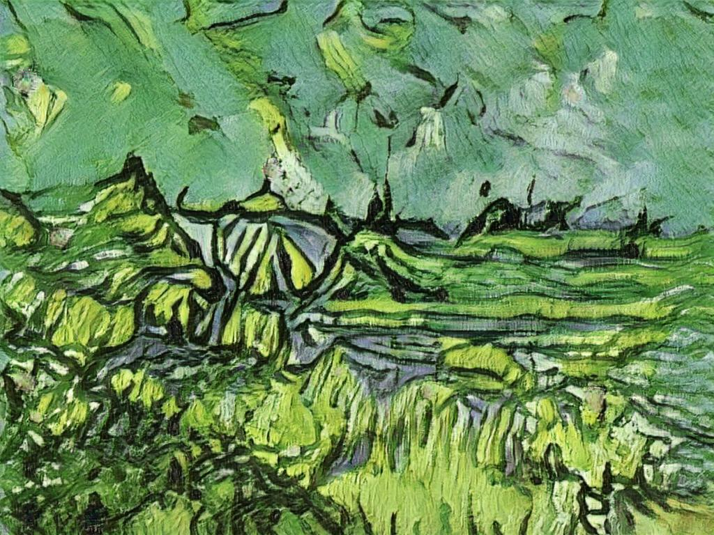</a></td>
  <td><a href="images/van-gogh/image1_s=10.jpg">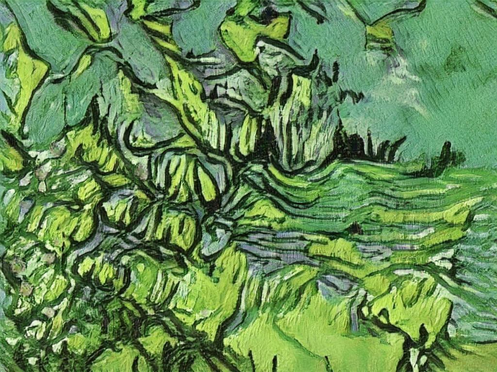</a></td>
  <td><a href="images/van-gogh/image1_s=20.jpg">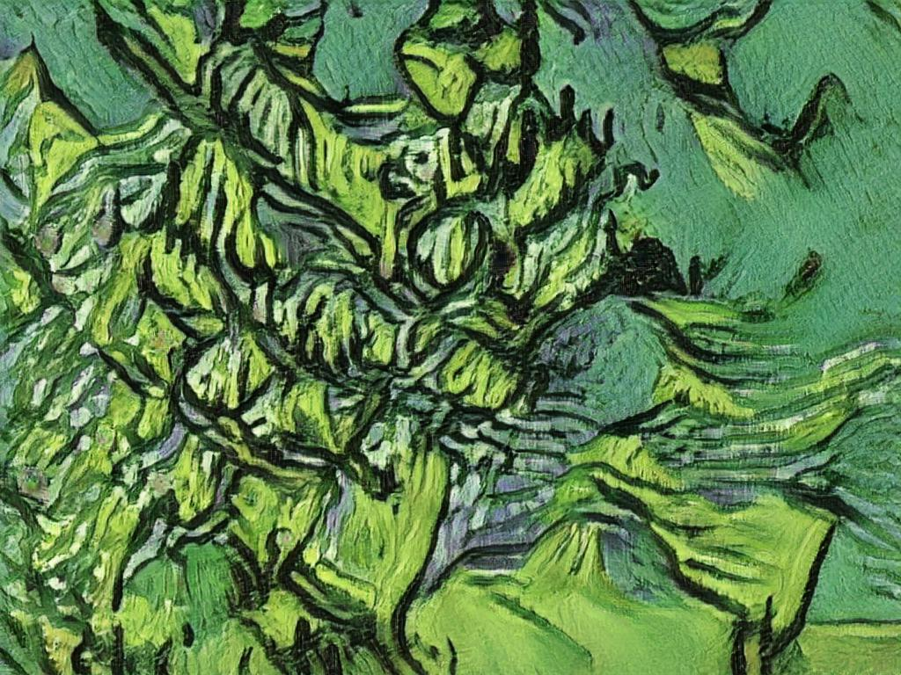</a></td>
 </tr>
 <tr>
  <td>s = 0</td>
  <td>s = 1</td>
  <td>s = 5</td>
  <td>s = 10</td>
  <td>s = 20</td>
 </tr>
</table>

The resampled images for different original images seem to be similar in their abstract appearance, yet they do not become more similar over time.

<table style="table-layout:fixed; width:1500px;">
 <tr>
  <td></td>
  <td><a href="images/van-gogh/image1_stylized.jpg">      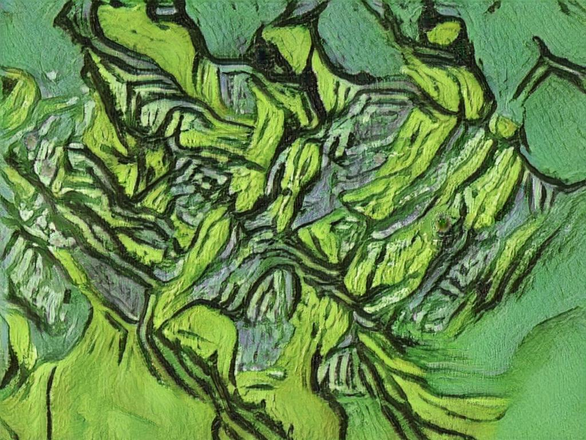  </a></td>
  <td><a href="images/picasso/image1_stylized.jpg">       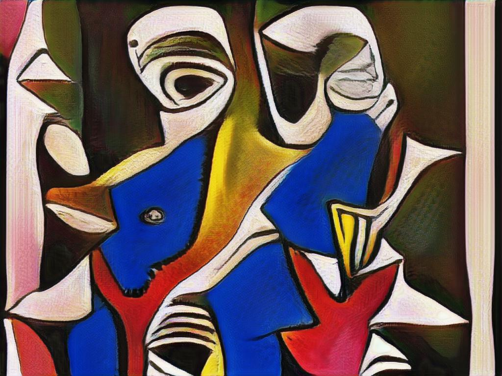   </a></td>
  <td><a href="images/cezanne/image1_stylized.jpg">       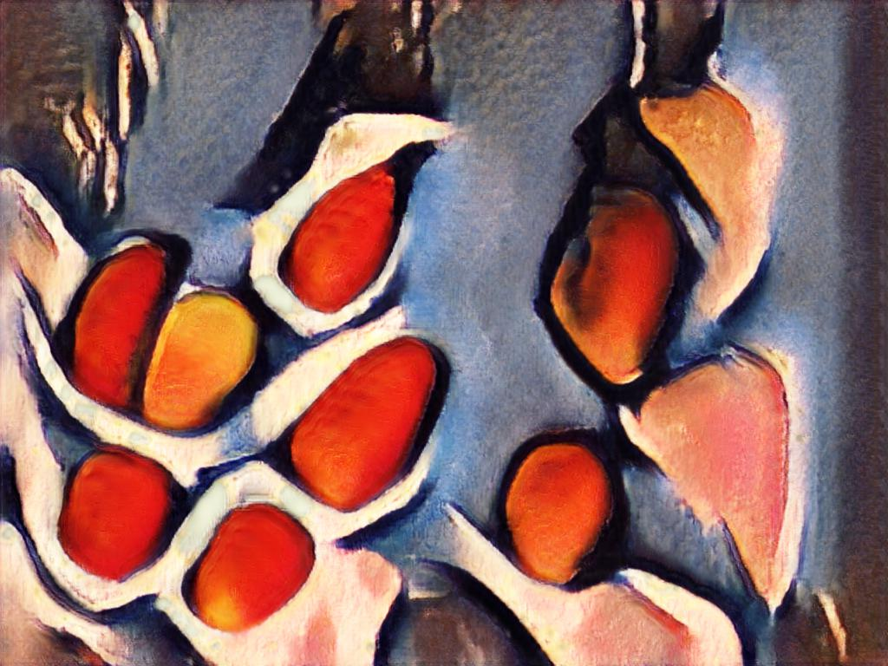   </a></td>
  <td><a href="images/el-greco/image1_stylized.jpg">      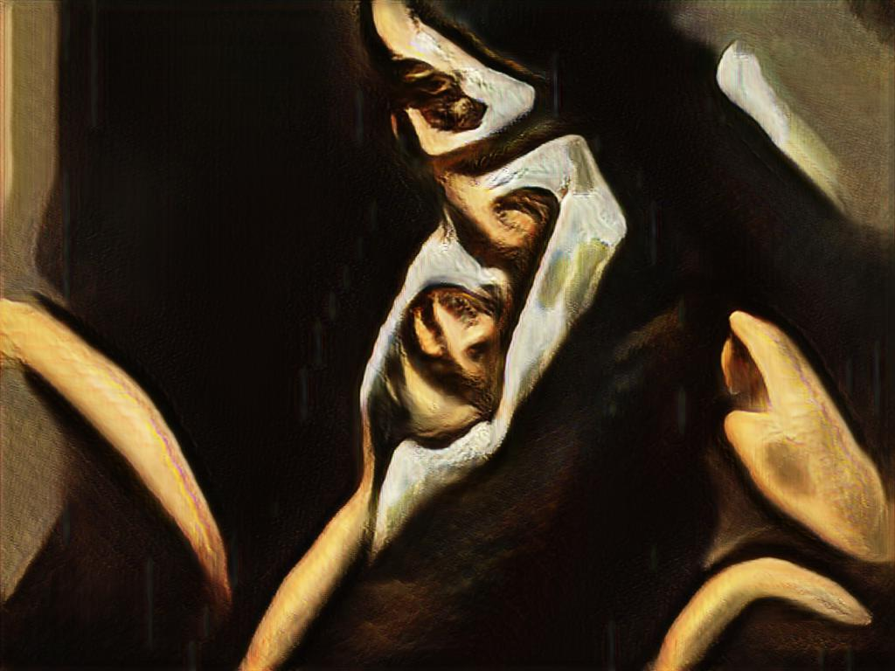  </a></td>
  <td><a href="images/gaugin/image1_stylized.jpg">        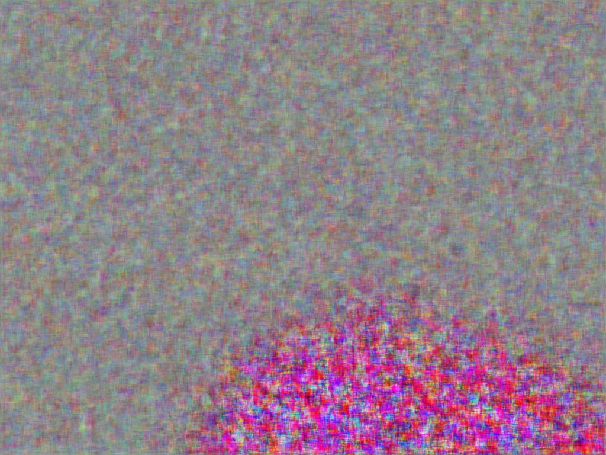    </a></td>
  <td></td>
  <td><a href="images/kirchner/image1_stylized.jpg">      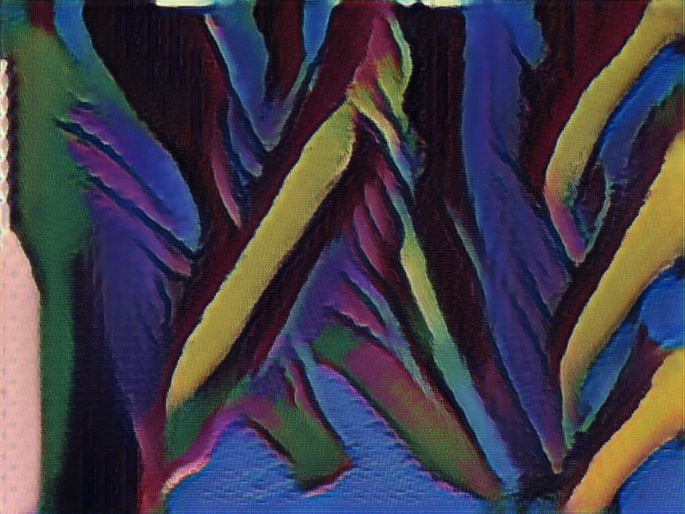  </a></td>
  <td><a href="images/monet/image1_stylized.jpg">         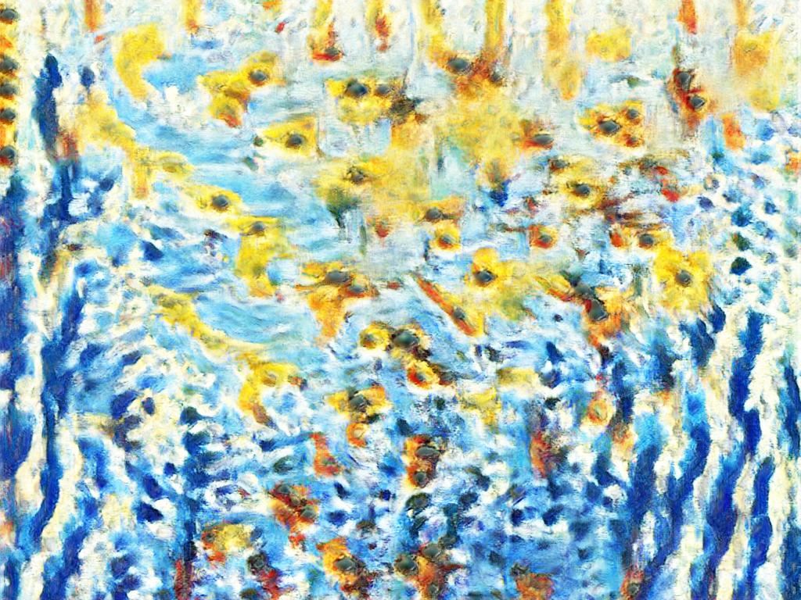     </a></td>
  <td><a href="images/morisot/image1_stylized.jpg">       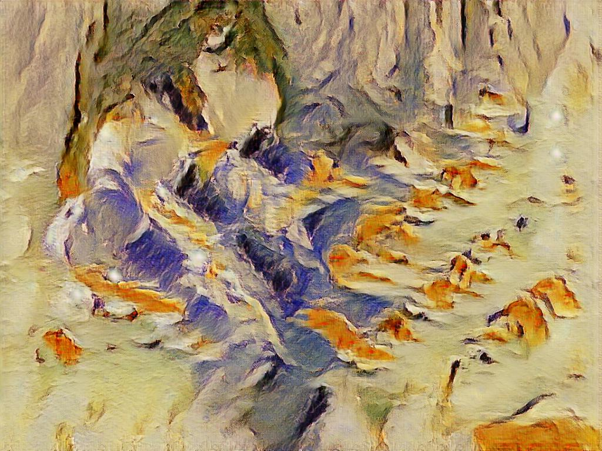   </a></td>
  <td><a href="images/peploe/image1_stylized.jpg">        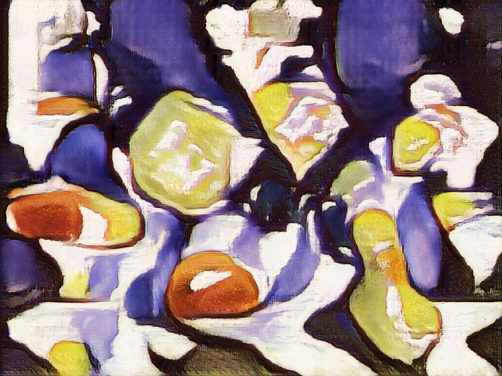    </a></td>
  <td><a href="images/pollock/image1_stylized.jpg">       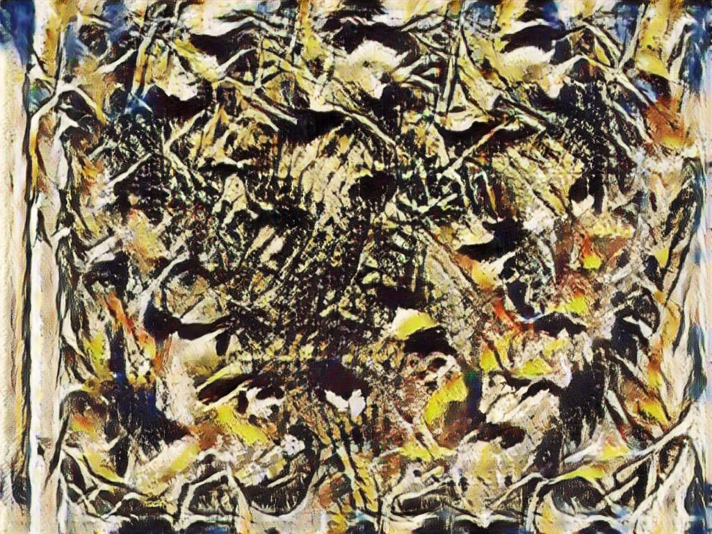   </a></td>
  <td></td>
 </tr>
 <tr>
  <td>original          </td>
  <td>van-gogh s=100    </td>
  <td>picasso s=100     </td>
  <td>cezanne s=100     </td>
  <td>el-greco s=100    </td>
  <td>gaugin s=100      </td>
  <td>kandinsky s=100   </td>
  <td>kirchner s=100    </td>
  <td>monet s=100       </td>
  <td>morisot s=100     </td>
  <td>peploe s=100      </td>
  <td>pollock s=100     </td>
  <td>roerich s=100     </td>
 </tr>
</table>

>TODO:show two different images original and after 100 iterations

Looking at 100 iterations for different styles for the same picture...
>TODO: videos of resampled style transfer

## visualizing embeddings/information
the results have been visualized using the following methods:
* For few test images scikit-learn's t-SNE and matplotlib give simple 2D images that indicate that embeddings are rather drifting apart:
> TODO: insert pictures for ~10 sample images with ~100 reencodings van gogh, picasso
Embeddings were taken from the same run as the pictures before

* More advanced plots (3D) should allow easier analysis. TensorBoard offers nice visualization for embeddings as well as scalar values at the cost of at times very high latency and long loading times for projecting embeddings
> TODO: insert images and maybe videos of TB for many images with many reencodings with color coding images the belong togehter
> TODO: scalar values that show the distance in feature space between consecutive images for the same data set

* for validation purposes use [UMAP](https://umap-learn.readthedocs.io/en/latest/). This requires again use of a different visualization tool. In this case [`bokeh`](https://bokeh.pydata.org/en/latest/) was used, which itself uses [`vis.js`](http://visjs.org) for plotting 3D graphs
<video controls="controls">
  <source type="video/mp4" src="umap.mov" width="1126" height="810">
  
Your browser does not support the video element.

</video>

## Conclusion
Contrary to my expectations, the process of reencoding image data does not tend to converge. Interestingly, after only ~10 (maybe a bit more) reencodings it is almost impossible for a human to infer the original image or the next 10 reencoding steps.
Looking at the scalar data and the plots, it even looks like the embeddings diverge to a certain degree although the reencodings of different original images look similar to the human eye.
Even for low resolution pictures (30x30 px) neither the image data nor the embeddings converge for 10,000 iterations. Looking at the t-SNE plot the data looks like a raveled ball of wool.

This is the original picture for 10,000 iterations.
It was taken from the Places365 database and cropped to 30x30 px.

This is the result after 10,000 iterations.

<video controls="controls">
  <source type="video/mp4" src="woolball.mov" width="796" height="751">
  
Your browser does not support the video element.

</video>

## Possible ideas for what still can be done
* __parallelize the process of inference__

    This is not really practical, as the increase in speed would be lower compared to starting multiple processes on different GPUs for different images.

    Maybe this is applicable to training instead of inference?

* __log the discriminators certainty of each reencoding!__

    Still a good idea to certain degree, might show strengths/weaknesses of network.

    Problem: The discriminators weights are not maintianed (?!) and one would have to train a new disrciminator

* __replace transformer block with i.e. flower vs. plane discriminator and then see if flowers/planes are better stylized__

    This should be talked about in advance, how much benefit this might give. The main problem is the very long training time for the original model (300,000 iterations per style).

